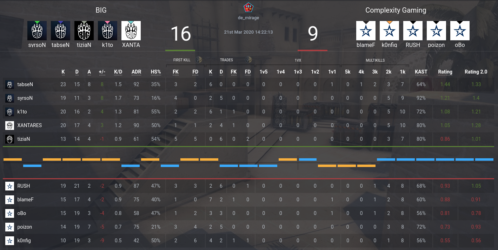

# csgostats.gg Rating 2.0 Userscript




This userscript adds HLTV's Rating 2.0 stat to csgostats.gg match scoreboards.

## Installation

### Make sure you have user scripts enabled in your browser

   * Firefox - install [Tampermonkey](https://tampermonkey.net/?ext=dhdg&browser=firefox)
   * Chrome - install [Tampermonkey](https://tampermonkey.net/?ext=dhdg&browser=chrome)
   * Opera - install [Tampermonkey](https://tampermonkey.net/?ext=dhdg&browser=opera)
   * Safari - install [Tampermonkey](https://tampermonkey.net/?ext=dhdg&browser=safari)

### Install the userscript

[](https://google.com/)

## Development

This project uses [ESLint](https://eslint.org/) and [EditorConfig](https://editorconfig.org/).

To install the development dependencies, simply install them via `npm`:

```console
$ npm install
```
